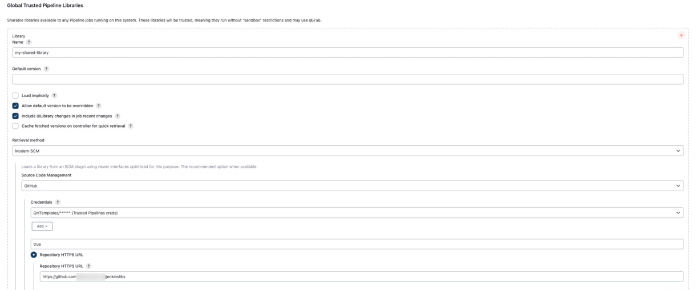

# Jenkins Pipeline Tsing Trusted Libraries

this pipeline is designed for demonstration purposes. You may modify it to fit your specific scanning and pipeline requirements. 

This example takes advantage of Jenkins Global Trusted Pipeline Libraries, making it easier to use, read, and reuse across different pipelines.

The template (`jenkins.groovy`) uses the [Mend CLI](https://docs.mend.io/bundle/integrations/page/scan_with_the_mend_cli.html) to run:
* **Software Composition Analysis (SCA)** scan using package managers (and file system scanning [optional]) to detect open-source components with report creating of:
    * Risk report
    * Inventory report
    * Due diligence report

* **Static Application Security Testing (SAST)** scan to detect languages and frameworks used in your projects and report code weaknesses and creates `sarif` report

The `vars` folder and its content need to be placed on the root of a Git repo and accessible by the Jenkins pipline, in this example, we'll be using github.com access.

### Create the trusted library

If you don't already have a trusted library repo, create one and configure Jenkins to access it from `Manage Jenkins->System->Global Trusted Pipeline Libraries`, see below example:

### Use the functions

In your Jenkins pipeline, make sure you are declaring the library as indicated on the [Jenkins.groovy](./Jenkins.groovy)
