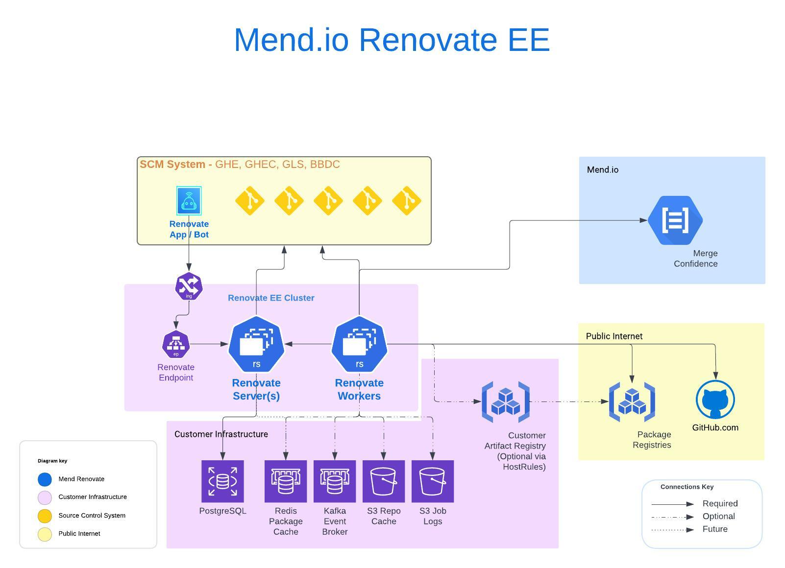

# Mend Renovate Enterprise -- Deployment Steps for GitHub Enterprise

## DISCLAIMER

> Mend cannot provide detailed deployment or configuration steps for customer infrastructure, including but not limited to: K8s, Helm, Redis, credential vaults, log aggregators, monitoring systems, firewalls, proxies, load balancers, DNS, and storage subsystems.

## References

The following Mend documentation is referenced in this doc:

- [Mend Renovate EE Documentation](https://github.com/mend/renovate-ce-ee/blob/main/docs/README.md)
- [Renovate OSS Documentation](https://docs.renovatebot.com/)

In most cases, linked referenced content will not be duplicated here.

## Renovate EE Architecture



## Technical Background

For high-availability and horizontal scalability, Renovate Enterprise consists of two containers,
_Renovate Server_ & _Renovate Worker_, along with the following supporting infrastructure:

- PostgreSQL
- Redis Package Cache
- S3 Repo Cache
- S3 Job Logs

In general, an enterprise deployment consists of running 2-3 Renovate Server replicas,
and as many Renovate Worker replicas as required based on the number of active repos onboarded to Renovate,
along with the supporting infrastructure listed above.
All of the supporting infrastructure components have high-availability deployment options.
Mend recommends utilizing those HA options.

#### Renovate Server

Renovate Server(s) are responsible for:

- Managing the worker job queue
- Receiving real-time inbound GitHub webhooks and queuing corresponding jobs
- Coordinating and scheduling background sync jobs
- Publishing reporting and monitoring APIs
- Optionally, can be deployed for [High Availability](https://github.com/mend/renovate-ce-ee/blob/main/docs/high-server-availability.md)

#### Renovate Worker

Renovate Workers wrap the open source Renovate CLI and are responsible for:

- Processing jobs from the Server job queue
- Providing horizontal scaling

Once the Renovate GitHub app is registered and installed in a GitHub Organization (Step 5 below),
webhooks for relevant repository events will be sent to the RenovateEE Server,
which requires an ingress load balancer and/or K8s Endpoint for the RenovateEE Server service.
See the diagram above.

Mend publishes RenovateEE container images to the [GitHub Container Registry](https://ghcr.io).

## Deployment Assumptions

- Your organization has access to and can pull container images from _ghcr_, either directly or via an artifact registry mirror (e.g., Artifactory).
- For Production, you may deploy separate Renovate EE cluster instances for each GitHub Org (or group of Orgs) you need to manage independently.

## Repo Onboarding Strategy

To avoid a "big bang" onboarding event that might overwhelm your infrastructure, Renovate onboarding should be configured to be opt-in.
To enable individual repos in the GitHub app, navigate to the GitHub org settings and GitHub Apps. In the Renovate app, select Configure. In the "Repository Access" section use the "Only select repositories" option to select the specific repositories that the Renovate app will operate on. For detailed instructions see [this section of the GitHub Enterprise Cloud documentation](https://docs.github.com/en/enterprise-cloud@latest/apps/using-github-apps/reviewing-and-modifying-installed-github-apps#configuring-repository-access). Repositories that have not been added to the Renovate app will be skipped regardless of them having a valid `renovate.json` file in their default branch.

> [!NOTE]
> The organization-level configuration repository (`{{parentOrg}}/renovate-config`) described in the ["Renovate Configuration Structure"](#org-level-config) section must be added to the list of repositories the Renovate app has access to. This configuration repository does not need to be onboarded to Renovate (i.e., it does not need a `renovate.json` file), but it must be included in the app's repository access list so that Renovate can read the `org-inherited-config.json` file and any organization-level preset files.

After enabling a repo in the GitHub app, repos will be onboarded when the dev team pushes a `renovate.json` file to their repo default branch.  
The default automatic onboarding PR will be disabled. Repos that don't have a `renovate.json` file will be skipped.

Related worker environment variables (added below):

- `RENOVATE_ONBOARDING: false`
- `RENOVATE_REQUIRE_CONFIG: required`

Additional considerations are detailed in this [knowledge base article](https://docs.mend.io/bundle/wsk/page/renovate_ee_-_configuration_considerations_when_skipping_onboarding.html).

## Renovate Configuration Structure

Configuration is layered hierarchically using a combination of environment variables,
static configuration file and dynamic repo hosted files. When the same Renovate GitHub App is installed
across multiple GitHub organizations, you can leverage a dedicated organization for shared global presets
that can be inherited by all onboarded organizations.

### Configuration Hierarchy (lowest to highest priority)

```
- Environment Variables (Server & Worker) - Self-hosted configuration options
  └─ config.js - Static configuration requiring secrets or cross-org access
     └─ Shared Cross-Org Global Presets (Optional)
        └─ Organization-Level Configuration
           └─ Organization-Level Presets
              └─ Repository-Level Configuration (Highest Priority)
```

### Configuration Layers Explained

- **Environment variables (server and worker)**
  - Used for setting [self-hosted configuration options](https://docs.renovatebot.com/self-hosted-configuration/#self-hosted-configuration-options)
  - Examples: `RENOVATE_ONBOARDING`, `RENOVATE_REQUIRE_CONFIG`, `RENOVATE_INHERIT_CONFIG`

- **`config.js`** - mapped into the Workers at deploy time
  - Used for configuration items that do not change and/or require secrets
  - **Private registry `hostRules`**: Authentication for Artifactory, npm registries, Maven repositories, etc.
  - **Cross-org `hostRules`**: Required when using a dedicated organization for shared presets
    - When presets are hosted in `{{dedicatedOrg}}/renovate-config`, but repos are in `{{otherOrg}}/{{repo}}`
    - The `hostRules` in `config.js` must grant access to the dedicated org's repository

- **Shared Global Presets (Optional - Dedicated Organization)**
  - `{{dedicatedOrg}}/renovate-config/{{preset-name}}.json`
  - Used for [shared custom defined presets](https://docs.renovatebot.com/config-presets/#github-hosted-presets) that should be available across all organizations
  - Useful when the same Renovate App is installed in multiple GitHub organizations
  - Requires `hostRules` in `config.js` to allow Workers processing repos in other orgs to access these presets
  - Can be referenced by org-level or repo-level configs via the `"extends"` clause

- **<a id="org-level-config"></a>Organization-Level Configuration**
  - `{{parentOrg}}/renovate-config/org-inherited-config.json`
  - Used for global org-level [repository configuration options](https://docs.renovatebot.com/configuration-options/#configuration-options)
  - This file should be visible (read-only) to developers
  - It helps developers understand the base configuration Renovate uses while processing their repos
  - Examples: global presets, `packageRules`, `customManagers`, `customDatasources`, PR limits, etc.
  - Can extend shared global presets from the dedicated org
  - The following worker environment variable setting is required:
    - `RENOVATE_INHERIT_CONFIG: true`

- **Organization-Level Presets**
  - `{{parentOrg}}/renovate-config/{{preset-name}}.json`
  - Used for org-specific [shared custom defined presets](https://docs.renovatebot.com/config-presets/#github-hosted-presets)
  - Can extend shared global presets from the dedicated org
  - Can be used in `org-inherited-config.json` or by individual repos via the `"extends"` clause

- **Repository-Level Configuration**
  - `{{parentOrg}}/{{repo}}/renovate.json`
  - Used for repo-level [repository configuration options](https://docs.renovatebot.com/configuration-options/#configuration-options)
  - Highest priority - overrides org-level and global settings
  - Can extend presets from dedicated org, org-level presets, or define repo-specific rules

> [!NOTE]
> For visibility and maintainability purposes, the repo-based configurations should be preferred over ENV vars and config.js.

## Deployment Steps

**_For each deployment environment (Dev, Stage, Prod):_**

1. **Renovate License Keys**

- Request a RenovateEE license key from Mend via email to your CSM.
- The license key can be reused across multiple environments, or separate keys may be requested at your discretion.

2. **Deploy PostgreSQL**

- Deploy a PostgreSQL instance or cluster, at your discretion.
- Mend recommends using Amazon RDS with the following specs for Production:
  - Db engine: PostgreSQL 16.3-R2
  - Instance: db.m5d.large
    - 2 vCPU
    - 16 GiB RAM
    - 100GB storage
- Ensure your Postgres instance is accessible from your Renovate K8s cluster.
- If deploying multiple Renovate EE clusters, each can be associated with a different database within the same RDS instance

> [!NOTE]
> For Postgres TLS support, you will need to volume map the Postgres TLS certificate PEM file into the
> Renovate Server container and populate the `MEND_RNV_POSTGRES_SSL_PEM_PATH` accordingly.

3. **Deploy Redis**

- Deploy a Redis standalone instance or cluster, at your discretion.
- Mend recommends using [AWS ElastiCache](https://aws.amazon.com/elasticache/).
- Ensure your Redis server/cluster is accessible from your Renovate K8s cluster.
- For Prod env, add Redis to your monitoring system, including the following [recommended Redis metrics](https://aws.amazon.com/blogs/database/monitoring-best-practices-with-amazon-elasticache-for-redis-using-amazon-cloudwatch/):
  - Memory allocated - alert at 80% utilization
  - Cache hit ratio - informational only
  - Latency - baseline, then alert at 150% of baseline

> [!NOTE]
> To maximize cache efficiency and operations costs,
> we recommend you deploy a single Redis cluster and single logical Redis database for multiple Production Renovate clusters.
> However, if you prefer, you can deploy separate Redis clusters per Renovate EE cluster.
> Cache efficiency will be impacted as the external items will be looked up and cached once per Renovate cluster instance.

> [!NOTE]
> If using a Redis (or Elasticache) cluster, the Redis url scheme is different (e.g. redis+cluster://).

4. **Provision S3**

- Provision S3 bucket(s) for the [repository cache](https://docs.renovatebot.com/self-hosted-configuration/#repositorycache) and job logs.
- Setup IAM roles for Mend cluster access. If IAM roles cannot be used for any reason, you can set AWS Key/Secret env vars for your Workers (see below).

> [!NOTE]
> You can provision a single S3 bucket per environment and use separate S3 folders for each of your Renovate cluster instances.
> Alternatively, you can use separate S3 buckets per environment as it does not impact Renovate caching or logging efficiency to do so.

**_For each Renovate EE cluster instance (Dev, Stage, Prod): (Steps 5-8)_**

5. **Register the Renovate GitHub application**

- Register a private [GitHub app](https://docs.github.com/en/apps/creating-github-apps/registering-a-github-app/registering-a-github-app) according to [these instructions](https://github.com/mend/renovate-ce-ee/blob/main/docs/setup-for-github.md#create-and-configure-the-github-app-bot).
- For deployments with multiple GitHub organizations, the same GitHub App should be installed in each organization to be onboarded to a single Renovate EE cluster.
- If you want to group certain organizations separately (e.g., by function, team, or other criteria), you can register additional GitHub Apps and deploy separate Renovate EE clusters for each group.
- For the Webhook URL field in the GitHub app, use the ingress load balancer for the Renovate Server endpoint url you will expose from the corresponding Renovate EE cluster that will handle those organizations.

> [!NOTE]
> For each Renovate EE cluster, securely capture the GitHub AppId, webhook secret and private key for use below.

6. **Prepare to deploy the Renovate Server pod(s):**

> [!NOTE]
> RenovateEE includes a sophisticated background job scheduler that categorizes repositories into several buckets based
> on onboarded status and relevant activity. Detailed documentation for the scheduler is a work in progress.
> For initial deployments, we recommend using the default schedules, and the configuration below will not include those settings.
> For production deployments, these [settings](https://github.com/mend/renovate-ce-ee/blob/main/docs/configuration-options.md#job-scheduling-options)
> can be tweaked and added to the Server configuration as required.

- See [example Helm charts](https://github.com/mend/renovate-ce-ee/tree/main/helm-charts/mend-renovate-ee) for reference.

- Create a K8s service for the Renovate Server:
- Add the following [environment variables](https://github.com/mend/renovate-ce-ee/blob/main/docs/configuration-options.md):

  - **Renovate Server Settings**
    - `MEND_RNV_ACCEPT_TOS: y`
    - `MEND_RNV_LICENSE_KEY: <license key>`
    - `MEND_RNV_MC_TOKEN: auto`
    - `MEND_RNV_PLATFORM: github`
    - `MEND_RNV_ENDPOINT: https://api.github.com/`
    - `MEND_RNV_GITHUB_APP_ID: <gh app id>`
    - `MEND_RNV_GITHUB_APP_KEY: <gh app key>`
      - _alternatively, you can map the pem file into the pod and specify:_
      - `MEND_RNV_GITHUB_PEM_FILE_PATH: <path/to/pemfile>`
    - `MEND_RNV_GITHUB_BOT_USER_ID: <bot user id>` # Optional
    - `MEND_RNV_WEBHOOK_SECRET: <secret from GH app setup>`
    - `MEND_RNV_SERVER_API_SECRET: <api secret>`
    - `MEND_RNV_ADMIN_API_ENABLED: 'true'`
    - `MEND_RNV_REPORTING_ENABLED: 'true'`
    - `MEND_RNV_SYNC_MODE: batch`
    - **_if running multiple Server replicas_**
      - `MEND_RNV_SYNC_ON_STARTUP: 'false'`
      - `MEND_RNV_ENQUEUE_JOBS_ON_STARTUP: disabled`
    - `MEND_RNV_LOG_HISTORY_S3: s3://<mendenv-bucket-name>/<log-root>`
    - `MEND_RNV_LOG_HISTORY_TTL_DAYS: 30` # 30 is default, set as required
    - `MEND_RNV_WORKER_CLEANUP: "0 0 * * *"` # cleanup daily, schedule as required (cron format)
    - `LOG_LEVEL: DEBUG`
    - `LOG_FORMAT: json`
    - `NO_PROXY: localhost, <no proxy list>`
    - `HTTP_PROXY: <proxy url>`
    - `HTTPS_PROXY: <proxy url>`
  - **PostgreSQL settings**

    - `MEND_RNV_DATA_HANDLER_TYPE: postgresql`
    - `MEND_RNV_POSTGRES_SSL_PEM_PATH: <path/to/mapped/pem/file>`
    - `PGDATABASE: <dbname>`
    - `PGUSER: <pguser with create schema permission>`
    - `PGPASSWORD: <pgpassword>`
    - `PGHOST: <hostname>`
    - `PGPORT: <hostport>`

  - Configure the following pod request/limit parameters:

    - Request
      - CPU: 0.6 (600m)
      - Memory: 2.0Gi
      - Disk: 2G
    - Limit
      - CPU: 1.0
      - Memory: 4.0Gi
      - Disk: 8G

  - Optionally, set the desired number of Server replicas for HA purposes (2-3).

7. **Prepare to deploy the Renovate Worker pods:**

- See [example Helm charts](https://github.com/mend/renovate-ce-ee/tree/main/helm-charts/mend-renovate-ee) for reference.

- Create a separate K8s service for the Renovate Workers.

- Add the following environment variables:

  - **Renovate Worker Settings**
    - `MEND_RNV_SERVER_HOSTNAME: <server service url, or load balancer/endpoint>`
    - `MEND_RNV_SERVER_API_SECRET: <api secret>` # same as server
    - `MEND_RNV_ACCEPT_TOS: y`
    - `MEND_RNV_LICENSE_KEY: <license key>`
    - `MEND_RNV_MC_TOKEN: auto`
    - `MEND_RNV_PLATFORM: github`
    - `MEND_RNV_ENDPOINT: https://api.github.com/`
    - `MEND_RNV_GITHUB_APP_ID: <gh app id>`
    - `MEND_RNV_GITHUB_APP_KEY: <gh app key>`
      - _alternatively, you can map the pem file into the pod and specify:_
      - `MEND_RNV_GITHUB_PEM_FILE_PATH: <path/to/pemfile>`
    - `MEND_RNV_GITHUB_BOT_USER_ID: <bot user id>` # Optional
    - `MEND_RNV_WORKER_EXECUTION_TIMEOUT: 60` # minutes, prevents a hung worker
    - `MEND_RNV_DISK_USAGE_WARN_THRESHOLD: 70`
  - **Renovate Core Settings**
    - `RENOVATE_ONBOARDING: 'false'`
    - `RENOVATE_REQUIRE_CONFIG: required`
    - `RENOVATE_INHERIT_CONFIG: 'true'` # onboarded repos will inherit the [organization-level configuration](#org-level-config)
    - `RENOVATE_REDIS_URL: rediss://<env-redisUrl>` # for a Redis cluster, use: `rediss+cluster://<env-redisUrl>`
    - `RENOVATE_CACHE_PRIVATE_PACKAGES: 'true'`
    - `RENOVATE_REPOSITORY_CACHE_TYPE: s3://<mendenv-bucket-name>/<cache-root>`
    - `RENOVATE_REPOSITORY_CACHE: enabled`
    - `RENOVATE_USER_AGENT: <userAgent>`
    - `AWS_REGION: <region, e.g. us-east-1>`
    - `LOG_LEVEL: DEBUG`
    - `LOG_FORMAT: json`
    - `NO_PROXY: localhost, <no proxy list>`
    - `HTTP_PROXY: <proxy url>`
    - `HTTPS_PROXY: <proxy url>`
  - **Private registry settings (if using Artifactory)** - _URLs need to be updated for other private package registry providers_

    - `MVN_USER: <username>`
    - `MVN_PASS: <password>`
    - `MVN_BASE_URL: https://<artifactory_instance>.jfrog.io/artifactory`
    - `MVN_RELEASE: https://<artifactory_instance>.jfrog.io/artifactory/libs-release`
    - `MVN_SNAPSHOT: https://<artifactory_instance>.jfrog.io/artifactory/libs-snapshot`
    - `GRADLE_PLUGIN_REGISTRY: https://<artifactory_instance>.jfrog.io/artifactory/libs-snapshot # Should have an upstream to a Gradle Plugin Repository (https://plugins.gradle.org/m2/)`
    - `GRADLE_PLUGIN_USER: <username>`
    - `GRADLE_PLUGIN_PASS: <password>`
    - `NPM_EMAIL: <user_email>`
    - `NPM_PASS: <artifactory provided password>`
    - `NPM_REGISTRY: https://<artifactory_instance>.jfrog.io/artifactory/api/npm/default-npm/`
    - `PIP_USER: <user_email>`
    - `PIP_PASS: <artifactory provided password>`
    - `PIP_REGISTRY: https://<artifactory_instance>.jfrog.io/artifactory/api/pypi/default-pypi/simple`
    - `GOPROXY: https://<username>:<password>@<artifactory-instance>.jfrog.io/artifactory/api/go/default-go/`
    - `NUGET_REGISTRY: https://<artifactory-instance>.jfrog.io/artifactory/api/nuget/default-nuget`
    - `NUGET_USER: <username>`
    - `NUGET_PASS: <password>`
    - `RUBY_REGISTRY: https://<artifactory-instance>.jfrog.io/artifactory/default-ruby`
    - `RUBY_USER: <username>`
    - `RUBY_PASS: <password> # This should be the password generated by Ruby when using Artifactory's "Set Me Up" feature.`
    - `COCOAPODS_REGISTRY: https://<artifactory-instance>.jfrog.io/artifactory/api/pods/default-cocoapods`
    - `COCOAPODS_USER: <username>`
    - `COCOAPODS_PASS: <password>`

  - Map the `config.js` file, which includes the private registry settings.
    The file should be mapped to the following path in the Worker container:

    - `/usr/src/app/config.js`

  - Configure the following pod request/limit parameters:

    - Request
      - CPU: 0.6 (600m)
      - Memory: 1.0Gi
      - Disk: 2G
    - Limit
      - CPU: 1.0
      - Memory: 4.0Gi
      - Disk: 40G (\*\* see note)

- Set the desired number of Worker replicas. A single Worker replica should be sufficient for up to ~1000 repositories.

> [!NOTE]
> \*\* Worker disk limit will be determined by repository needs.
> A large monorepo with many node_modules may require more than 40G.

8. **Setup Renovate Global Configs**

- **Optional: Shared Cross-Org Global Presets (Dedicated Organization)**
  - If you plan to use shared global presets across multiple organizations, create a `renovate-config` repository in a dedicated GitHub organization.
  - This repository will host enterprise-wide presets that can be referenced by all other organizations.
  - Add any shared global [custom presets](https://docs.renovatebot.com/config-presets/) as `{{preset-name}}.json` files in this repository.
  - **Important**: Ensure your `config.js` includes `hostRules` to allow Workers processing repos in other organizations to access this dedicated org's preset repository (see the "Renovate Configuration Structure" section above for details).

- **Organization-Level Configuration**
  - Create a `renovate-config` repository in each of your onboarded GitHub organizations for the Renovate organization-level configuration files.
  - Commit the following files to this repository:
    - `org-inherited-config.json` - Global org-level configuration inherited by all repos in the organization (when `RENOVATE_INHERIT_CONFIG: true` is set)
    - Any organization-specific pre-defined [custom presets](https://docs.renovatebot.com/config-presets/) as `{{preset-name}}.json` files
  - The `org-inherited-config.json` file should be visible (read-only) to developers to help them understand the base configuration Renovate uses.
  - Organization-level configs and presets can extend shared global presets from the dedicated org (if used) via the `"extends"` clause.

> [!NOTE]
> You should include any mandatory or optional [shared presets](https://docs.renovatebot.com/config-overview/#shared-presets) files you want to provide for your developer teams. Repository-level configuration files (`renovate.json`) can be added later by individual development teams in their repositories.

9. **Deploy the Renovate pods to the Dev environment**

- Monitor Renovate logs for Errors

10. **Deploy the Renovate pods to the Stage environment**

- Monitor Renovate logs for Errors

11. **When ready for production deployment:**

- Deploy the Renovate cluster(s) to the Prod environment
- Monitor Renovate logs for Errors
- Measure the impact of Renovate on GitHub API usage via Renovate log queries
- Monitor and track the Renovate Server queue length via the `/system/v1/status` API endpoint as outlined in the [Renovate documentation](https://github.com/mend/renovate-ce-ee/blob/main/docs/api-system.md#status) or via Prometheus `/metrics` endpoint [exposed by the Renovate server](https://github.com/mend/renovate-ce-ee/blob/main/docs/api.md#prometheus-metrics).

12. **For each repository to be onboarded:**

- Onboard repositories by adding them to the Renovate GitHub app
- To complete the onboarding process, have the developer team push a `renovate.json` file to their default branch.
