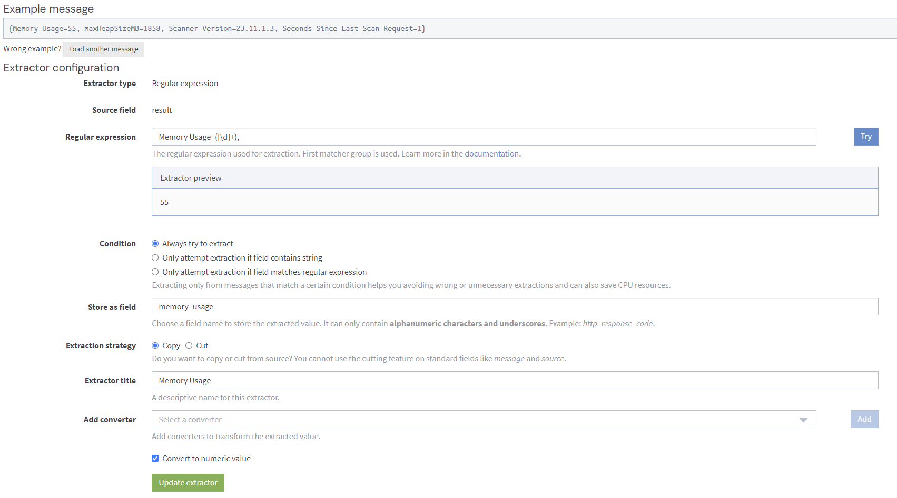
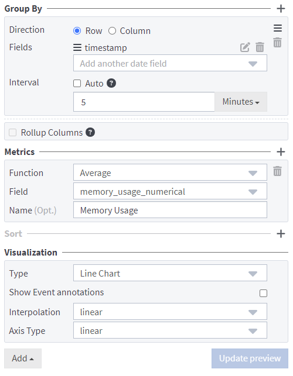

## Important Graylog Information

If you are new to Graylog, then there might be some confusion on search queries, how the dashboards work, etc. This documentation is meant to bridge the gap between the [Graylog Documentation](https://go2docs.graylog.org/5-2/home.htm) and Mend's implementation of it for the Repository Integrations.

### Searches
Searching in graylog is simplistic in nature, and no information or formatting is saved on the "Searches" page after navigating away from it. This means that if you create some widgets or a specific way of searching, then you should save that information to a Dashboard to refer back to later. Typically, there will be three main ways of searching.  
- "\<keyword\>" - This method simply just filters for a keyword(s) in the full message received by the server.  
`"/payload/healthcheck"` <- Only shows messages that have the string "/payload/healthcheck"  

- \<field\>:"\<keyword\>" - This searches for a keyword in a specific field. These fields are typically created by [extractors](#Extractors).  
`ctx:abcd1234ef5678` <- Finds all messages where the CTX field equals "abcd1234ef5678"

- \_exists\_:\<field_name\> - Whether or not an extractor resolved a field in the message or not.  
`_exists_:logContext` <- Determines if logContext was a field that was resolved (Great for looking through Remediate logs).

#### Logical Operators
Graylog Searches can also make use of the logical operators: AND, OR, and NOT.

This is the majority of what you can do with searching. For more documentation on the search query language Graylog uses, you can reference their [Search Query Documentation](https://go2docs.graylog.org/5-2/making_sense_of_your_log_data/writing_search_queries.html?Highlight=search%20queries). If you need to parse more information, then you can do that with extractors.

### Extractors
Extractors take information from messages sent to the server, or from other extractors, and manipulates the information, outputting it to a "field". This field can then be used in searches, dashboards, other extractors, and more. 

For instance, if I want to start monitoring the average CPU usage of the scanner container with a line chart, I would first set up an Input of the type: "JSON Path value from HTTP API" and set it up to go to the scanner's healthcheck API endpoint. This returns a few different pieces of information. The output typically looks like:  
`JSON API poll result: $ -> {result={Memory Usage=48, maxHeapSizeMB=1858, Scanner Version=23.11.1.3, Seconds Since Last Scan Request=16}}`  
**Note: This is not the exact output from the scanner API, but this is how the extractor parses it**

From here, I can create a Regex Extractor to get the "Memory Usage" portion, and then convert the answer to an Integer on output. This allows for numerical processing.  

Afterwards. You can create a dashboard widget with the Line Graph type, that uses the timestamp of the message as the "Group By" field, and the Metric being an average of "memory_usage".

### Inputs

Inputs are objects that typically open a port where messages get sent to. The exception to this is the "JSON Path value from HTTP API" input which periodically sends API requests to an endpoint. This is particularly helpful for sending healthcheck messages to the integration containers.

>[!WARNING]  
**Concerning the JSON Path value from HTTP API" input. If the API sent returns anything other than a 200, then the input itself will mark as failing, and will not record the failed healthcheck. This typically means that when creating a healthcheck widget, you will want to just count the number of returned requests, and use that to generalize the overall health of the container.** 

For the Integration itself, we open port 5140/tcp to Syslog messages, which then get sent from the integration containers. Extractors take the appropriate information from the different logs which then get represented in the different Search dashboards.

### Dashboards

Dashboards can be confusing, as there isn't much information around them. Some important information to remember is each widget has it's own search settings, that can get overridden with the global search option. The best way to format a dashboard is to create a new one, and then create widgets using the following steps:  
1. Click the plus on the left-hand side of the screen, and select the widget type you would like to use.  
1. Click edit on the new widget.
1. Specify the time range for the data you want shown, and then run the appropriate search to get the data required.
1. Specify the type of visualization such as "Line Graph", "Bar Graph", etc.
1. Fill out the information required for the widget. If you want to visualize data over time, then add a "Group By" section and set the field to timestamp. Meanwhile the data that you actually want shown will be placed under "Metrics".
1. When you are satisfied with the information entered, click "Update Preview" to make sure that everything looks right, and then click "Update Widget".

Now that you have a widget created, it will always show information with regard to what you put in that window. If you want to override what it shows temporarily, then you can use the search function on the main page to temporarily show different data.