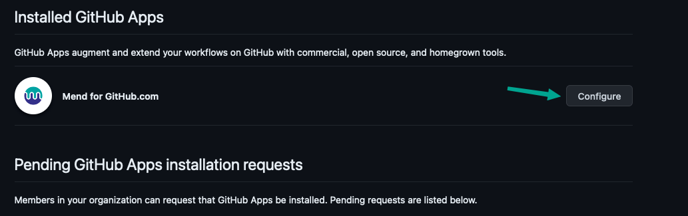
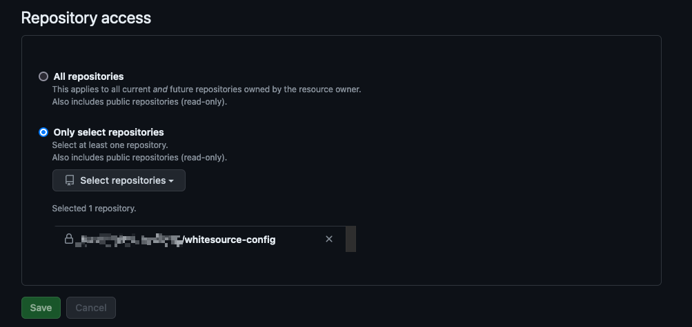

# Silent Onboarding with GHC Integration

## Table of Contents
- [The Reason for Silent Onboarding](#the-reason-for-silent-onboarding)
- [Initial Installation](#initial-installation)
- [Global Configuration](#Global-Configuration)
- [Repository Configuration](#Repository-Configuration)
- [Installing the Integration](#Installing-the-Integration)
- [Gradual Implementation](#Gradual-Implementation)

### The Reason for Silent Onboarding
When installing the [Mend for Github.com](https://docs.mend.io/bundle/integrations/page/scan_your_repositories_with_mend_for_github_com.html) repository integration, by default the integration creates a Pull Request with a .whitesource file in every repository where the github application is installed and a checkrun is created on every Repository. This can create a great amount of noise on these repositories, and if the organization is using Github Actions for their workflows, then those will be blocked until the "Mend Security Check" checkrun has completed successfully. In circumstances such as these, it is recommended to start with a silent onboarding so as to not interrupt development.

### Initial Installation
To reduce noise, before the [Mend for Github.com](https://docs.mend.io/bundle/integrations/page/scan_your_repositories_with_mend_for_github_com.html) is installed, create a repository named ``whitesource-config`` and make sure that there are no branch-protection rules on the repository. Afterwards, install the "Mend for Github.com" app and follow the instructions, but make sure the repository only has access to the ``whitesource-config`` repository. Do not install the app on other repositories yet.

> [!TIP]  
> If your organization requires branch protection rules on all repositories, do not worry, you can copy and paste the configurations from this repository into yours.

After installing the app on this repository, then two new files will be created, a [``global-config.json``](#Global-Configuration) and a [``repository-config.json``](#Repository-Configuration). These two files make up the global configuration for your integration, and will house all of the defaults for all repositories that are scanned.

### Global Configuration
The global-configuration.json file initially has ``"repoConfigMode": "createOnboardingPR"`` in it. This should be changed to:
```json
{
  "repoConfigMode": "nowhitesourceFile"
}
```

This will prevent any onboarding Pull Requests from getting created. It's important to note that at this point, any other repository that the integration has access to will be scanned. This is why no other repositories should be scanned at this point.

### Repository Configuration
If your ``repo-config.json`` file has already been created, then you will need to edit the contents of the file to have the following:

```json
{
  "scanSettings": {
    "configMode": "AUTO",
    "configExternalURL": "",
    "baseBranches": [],
    "enableLicenseViolations": false,
    "exploitability": false
  },
  "scanSettingsSAST": {
    "enableScan": false,
    "scanPullRequests": false,
    "incrementalScan": true,
    "baseBranches": [],
    "snippetSize": 10
  },
  "checkRunSettings": {
    "vulnerableCheckRunConclusionLevel": "none",
    "failOnVulnerabilityMinSeverity": "CRITICAL",
    "licenseCheckRunConclusionLevel": "success",
    "displayMode": "diff",
    "useMendCheckNames": true,
    "strictMode": "warning"
  },
  "checkRunSettingsSAST": {
    "checkRunConclusionLevel": "success",
    "severityThreshold": "high"
  },
  "issueSettings": {
    "minSeverityLevel": "NONE",
    "displayLicenseViolations": false,
    "issueType": "DEPENDENCY"
  },
  "remediateSettings": {
    "enableRenovate": false,
    "workflowRules": {
      "enabled": false,
      "minVulnerabilitySeverity": "CRITICAL"
    }
  },
  "imageSettings": {
    "imageTracing": {
      "enableImageTracingPR": false,
      "addRepositoryCoordinate": false,
      "addDockerfilePath": false,
      "addMendIdentifier": false
    }
  }
}
```

This configuration describes to the integration what scans to perform as well as other settings. As you can see, all scans except for SCA dependency scans are disabled by default. Here are some other settings to note:  
- Checkruns are _**NOT**_ created for each SCA scan. This is denoted by  
``checkRunSettings.vulnerableCheckRunConclusionLevel=none``.  
  - When this parameter is been changed to "success" or "failure" then it will create a checkrun, however it will only fail the checkrun on a repository that has security vulnerabilities if it is set to failure.  
  - When this parameter is set to "failure", then it will only fail checkruns that have **CRITICAL** security vulnerabilities. This is due to: ``checkRunSettings.failOnVulnerabilityMinSeverity=CRITICAL``.  
  - If this parameter is set to "failure" and building the project fails, then a warning will be presented in the checkrun message but the checkrun will not fail. This is denoted by ``checkRunSettings.strictMode=true``  
- Github Issues will not be created after scans. This is denoted by ``issueSettings.minSeverityLevel=NONE``.  
  - When the above parameter has been changed to **CRITICAL** then issues will be created for Critical Severity Vulnerabilities.  
- Renovate PRs will not be created. This is denoted by: ``remediateSettings.enableRenovate=false``  
- Remediate PRs will not be created. This is denoted by: ``remediateSettings.workflowRules.enabled=true``  

### Installing the Integration
> [!IMPORTANT]  
> Once these next steps have been completed, then the Mend Repository Integration will automatically scan every single repository it has access to. Github.com Repository Integration customers are limited to 6 concurrent scans, so if a large amount of repositories need to be scanned, then this process could take some time to complete.  

Once the above configuration files are created properly, then you are ready to start onboarding repositories. To do this go to your Github Organization -> Settings -> Github Apps -> Mend for Github.com -> Configure.  

  
Here you will see a section that says: "Repository Access", choose "Only select repositories" and select a couple of repositories that you would like scanned.  

  

Once you click save, then the "Mend for Github.com" Repository integration will start scanning the repositories that you have selected. This initial onboarding is to make sure that the scans are performed properly, and that the appropriate information shows up in the Mend UI. Once you have confirmed that the scans are executing properly, then you can set the "Repository access" to "All repositories".

### Gradual Implementation

After the "Mend for Github.com" Repository integration has finished scanning all of your repositories, then users can slowly start introducing checkruns for the scans, issues for vulnerabilities, and fix pull requests as well. The proper way to do this would be to create a .whitesource file in the repositories that are ready for it, and override any settings that are in the ``repo-config.json`` file. For instance:
```json
{
  "settingsInheritedFrom": "<my-organization>/whitesource-config@main",
  "checkRunSettings": {
    "vulnerableCheckRunConclusionLevel": "success"
  },
  "issueSettings": {
    "minSeverityLevel": "CRITICAL"
  },
  "remediateSettings": {
    "workflowRules": {
      "enabled": true
    }
  }
}
```

This configuration will turn on checkruns, but not make them fail in case of Github Actions, the checkrun will only report on Critical Vulnerabilities due to the setting ``checkRunSettings.failOnVulnerabilityMinSeverity=CRITICAL`` in the ``repo-config.json``.
The next thing this configuration does is override ``issueSettings.minSeverityLevel=NONE`` to ``CRITICAL``, which will only open up issues for security vulnerabilities. The last thing this integration does is override ``remediateSettings.workflowRules.enabled=false`` to ``true``. Which will allow remediate to open up fix pull requests for the vulnerabilities detected from the scans.

In the future, once all teams have configured their repositories to properly work with checkruns for instance, then this setting can be migrated to the ``repo-config.json`` file, and removed from the repositories ``.whitesource`` file. 
